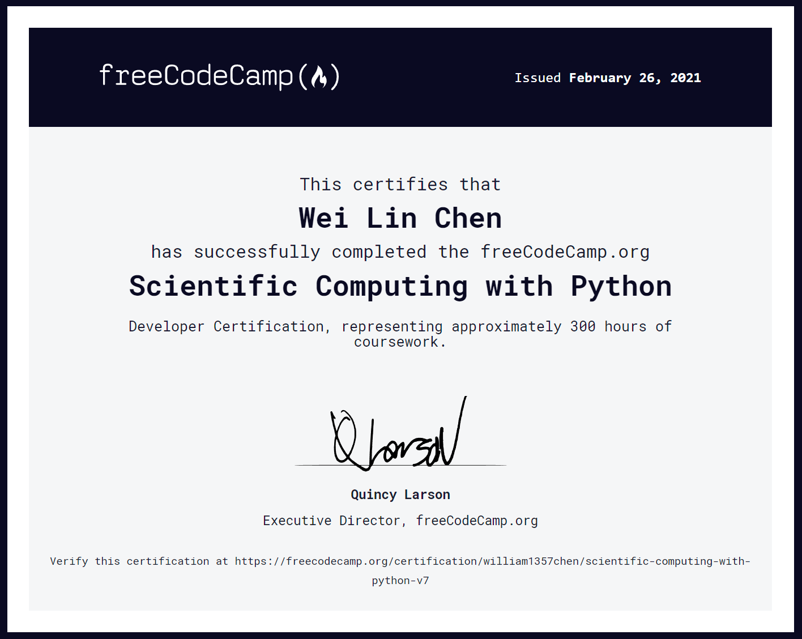

# freeCodeCamp Machine Learning with Python
These are the five projects for the Scientific Computing with Python curriculum on freeCodeCamp.
 
## Project List
* [Arithmetic Formatter](fcc-arithmetic-formatter)
* [Time Calculator](fcc-time-calculator)
* [Budget App](fcc-budget-app)
* [Polygon Area Calculator](fcc-polygon-area-calculator)
* [Probability Calculator](fcc-probability-calculator)

## Overview
The cirruculum demonstrates my familiarity with the Python language and my competence in solving fundamental mathematics problems using Python. 

## Certification

